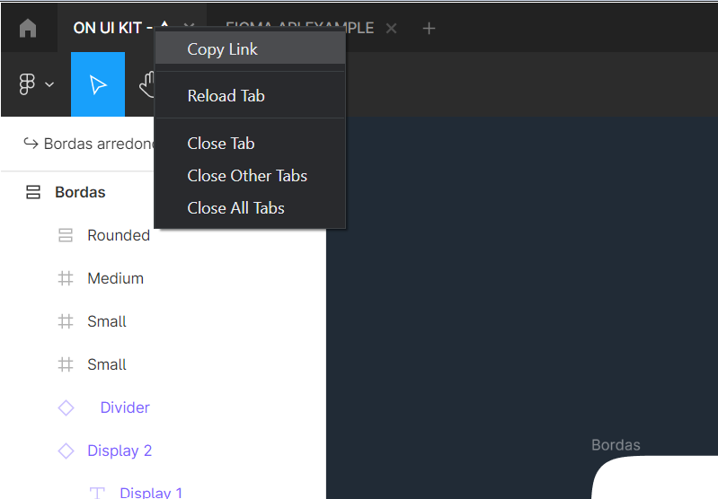
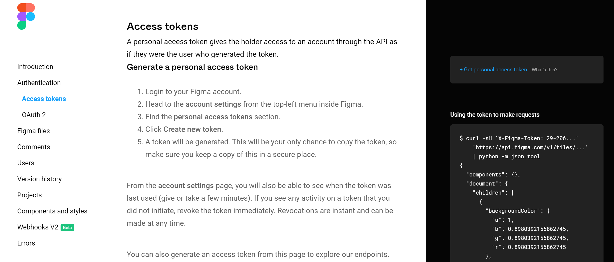
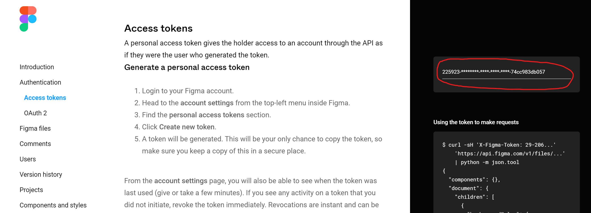
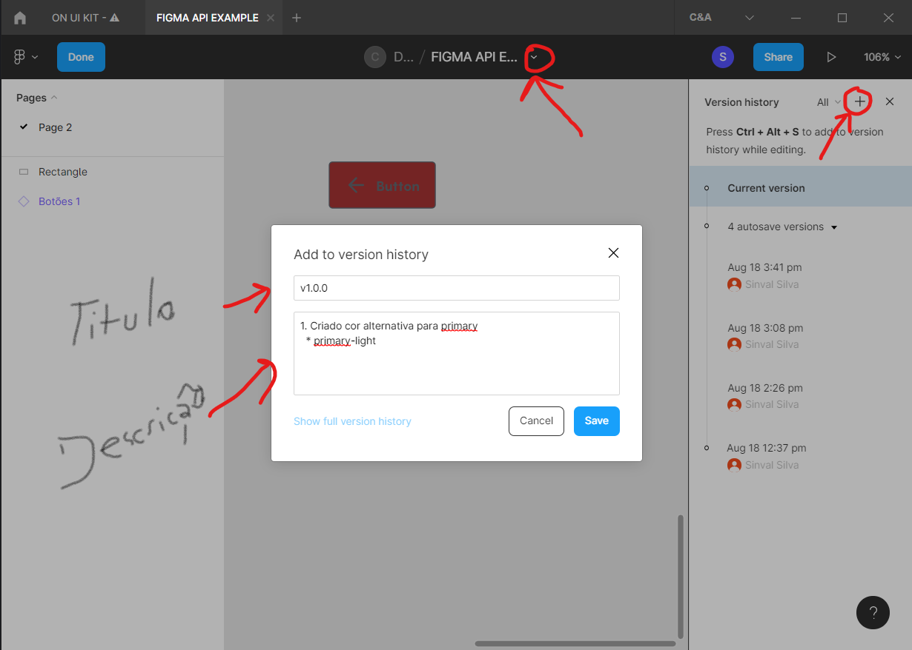

# FIGMA API GATEWAY

## Overview

Nesse projeto vamos abordar algumas possibilidades de consumo dos recursos gerados no FIGMA, para serem utilizados de diversas formas o intuido é mostrar essas possibilidades para serem aplicadas maneira que decidir ser mais produtivo no seu dia-a-dia de seu processo de desenvolvimento.

## Utilização

Alguns comandos do projeto estão prontos para as seguintes tarefas abaixo:

1. Criar arquivo JSON com todo o `response` vindo do `figma`.

    * No terminal digitar `npm start` para gerar no diretório `models` o arquivo com `response`, dependendo do seu projeto no figma esse arquivo pode ser muito extenso.
    * O exemplo oficial desse payload pode ser encontrado também [aqui](https://www.figma.com/developers/api#access-tokens).
    ```json
    {
      "components": {},
      "document": {
        "children": [
          {
            "backgroundColor": {
              "a": 1,
              "b": 0.8980392156862745,
              "g": 0.8980392156862745,
              "r": 0.8980392156862745
            },
            "children": [],
            "exportSettings": [],
            "id": "0:1",
            "name": "Page 1",
            "type": "CANVAS",
            "visible": true
          }
        ],
        "id": "0:0",
        "name": "Document",
        "type": "DOCUMENT",
        "visible": true
      },
      "schemaVersion": 0
    }
    ```
   
## Implementação

1. Para consumir a API é necessário utilizar o `OAuth 2.0` com algumas propriedades encontradas no FIGMA.

   * Primeiro precisamos do `ID` do arquivo encontrado em um projeto Figma.
   
   * Se vc utiliza o aplicativo do Figma no Windows pode seguir o passo do exemplo abaixo.
   
   

   * O link tem esse formato: `https://www.figma.com/file/ycBsmtPQCzyLHA3ac4p1T1/FIGMA-API-EXAMPLE?node-id=10%3A2307`.
   
   * O `ID` do arquivo é o que vem logo depois de `file/`, `ID: ycBsmtPQCzyLHA3ac4p1T1`.
   
   * Com o `ID` do arquivo no Figma agora precisaremos de um `Session Token` que é adquirido [aqui](https://www.figma.com/developers/api#access-tokens).

   

   * Clicando no link da imagem a cima `+ Get personal access token What's this?` ele revelará o seu token.

   

   * **ATENÇÃO**: Você deve ter uma conta no Figma e estar logado na pagina para o token poder ser gerado, se não possui pode adquirir por [aqui](https://www.figma.com).
   
   * Ultimo passo agora é fazer a request para o Figma como no exemplo de código node abaixo.
   
   ```javascript
   const request = require("request");

   const FILE_ID = 'ycBsmtPQCzyLHA3ac4p1T1';
   const TOKEN = `224876-e8f26b47-8311-4d00-9cfe-cc3048bad5b4`;
   
   const options = {
     method: 'GET',
     url: 'https://api.figma.com/v1/files/' + FILE_ID,
     headers: {
       'X-Figma-Token': TOKEN
     }
   };
   
   request(options, function (error, response) {
     if (error) throw new Error(error);
     console.log(response);
   });
   ```
   
## Integrações CI/CD

1. Para os processos de deploy automatizado baseado em mudanças o Figma recomenda que utilizemos os Webhooks V2 que nos informa as mudanças no projeto do Figma e nos da informação para tratamentos em nossos scripts e ambientes integrados.

   * Podemos encontrar todos os Webhooks [aqui](https://www.figma.com/developers/api#webhooks_v2). 

## Versionamento o Figma

1. É possível criar versões semânticas no Figma como na imagem abaixo.

